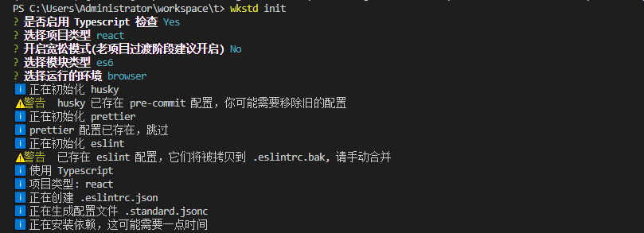

# wkstd

WakeData 前端代码规范工具集

<br>

前端代码规范主要包含以下几个方面:

- 代码格式化。我们选用比较流行的 prettier，prettier 支持多种文件的格式化，例如 Typescript、JavaScript、Markdown、Vue、CSS 等等。
  配置规则也比较简单。选用中立的代码格式化风格，可以免于无畏的争论。
- JavaScript 代码规范。目前使用最为广泛的是 ESLint，对于规则我们则选用 [JavaScript Standard](https://standardjs.com/readme-zhcn.html#%E6%9C%89%E7%9B%B8%E5%85%B3%E7%9A%84-nodejs-api-%E6%B2%A1) 作为基础, 再根据团队情况进行扩展
- CSS 代码规范。选用 stylelint

<br>
<br>

## 项目包结构及继承关系

```shell
- wkstd                       # 命令行工具，用于在本地或 CI 验证代码

- eslint-plugin-wk            # Wakedata 扩展的 ESLint 规则

- eslint-config-wk            # 通用 ESLint 配置，适用于常规项目
  - eslint-config-wkts        # 适用于 React 项目, 继承 wk
  - eslint-config-wkreact     # 适用于 React 项目, 继承 wk
    - eslint-config-wktaro    # 适用于 Taro 项目, 继承 wkreact
  - eslint-config-wkvue       # 使用于 Vue 项目，继承 wk 

- stylelint-config-wk         # 通用的 Stylint 配置
  - stylelint-config-wktaro   # 适用于 Taro 项目, 继承 wk
  ...                         # TODO

- prettier-config-wk          # 通用的 prettier 配置
```

为了方便历史代码迁移，eslint 配置都有一个 loose 宽松版本, 例如:

```json
{
  "extends": ["wk/loose", "wkreact/loose"]
}
```


## 安装

<br>

```shell
$ yarn add wkstd -D

# or

$ npm i wkstd --save-dev
```

<br>

## 命令

### 初始化:  `wkstd init`

<br>

执行:

```shell
$ yarn wkstd init

# or

$ npx wkstd init
```

<br>



<br>

初始化完成后会生成 `.eslintrc.json`、prettier、.standard.jsonc、.editorconfig 等配置文件，按照必要的依赖。

另外 `package.json` 加入 husky 配置:

```json
{
  "husky": {
    "hooks": {
      "pre-commit": "wkstd local-check"
    }
  }
}
```

<br>
<br>

### 自动修复: `wkstd fix <pattern>`

修复支持自动修复的问题, **建议在 wkstd init** 之后执行一次:

<br>

```shell
$ wkstd fix src/**/*
```


<br>
<br>


### 本地验证:  `wkstd local-check`

<br>

wkstd 有两种代码规范验证方式，一种是本地验证(`local-check`)，一种是远程 CI 验证(`remote-check`)。
**一般情况下你不应该手动调用这些命令**。

本地验证和 husky 配置，在用户提交(git commit)代码时，对应提交的代码进行格式化和规范验证。**如果验证失败，git 会拒绝提交**

> ⚠️ 虽然你可以通过 git commit --no-verify 跳过本地验证。但是不建议这么做！


<br>

### Gerrit 远程验证: `wkstd gerrit-check`

只对当前提交变动的文件进行验证，使用于 Gerrit 项目。用于远程 CI 环境。

<br>
<br>


### 远程验证: `wkstd remote-check`

<br>

由于本地验证可以通过某些手段跳过，所以建议在远程 CI 环境多一层拦截。

remote-check 和 local-check 一样，默认采用增量验证，也就说，他只会对你提交的代码进行验证。

配和 Jenkins 的用法见[这篇文档](https://www.notion.so/Lint-714245be386a42a78120b7711e2c44a5)


<br>
<br>

### 升级: `wkstd update`

升级 wkstd 相关依赖

<br>
<br>

## 贡献

<br>

建议通过 Issue 提交需求和问题. 

<br>

本项目依赖于 yarn, 调用下面的命令初始化依赖:

```shell
$ yarn bootstrap
```
